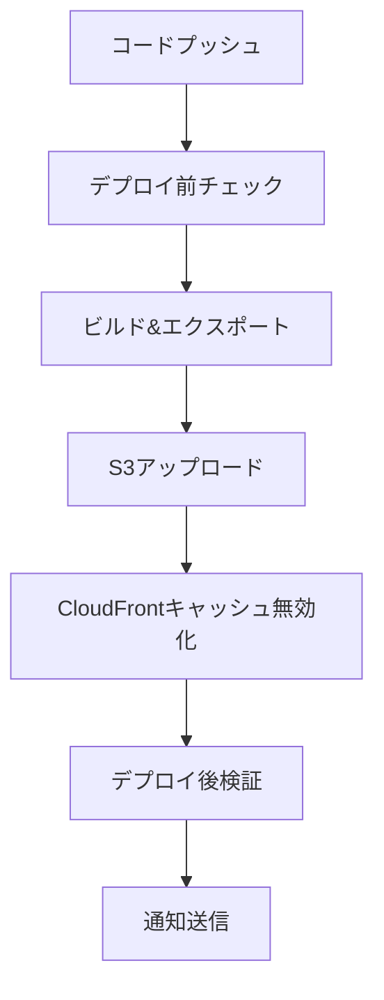

# AI Technology Journal

生成AIとITツールの比較・情報サイト

## 特徴

- Next.js静的サイト生成
- Markdown記事管理
- レスポンシブデザイン
- SEO対策済み
- 広告枠・アフィリエイト対応
- **自動記事生成・公開システム**

## 自動化機能

### 毎日の記事自動生成
- GitHub Actionsで毎日午前9時に実行
- **完全AI自動生成**: タイトルと内容をAIが自動で考案・生成
- 2000文字程度の高品質記事を自動生成
- AIツール比較、SaaS紹介、業務効率化の3カテゴリーをローテーション
- 自動的にGitリポジトリにコミット・プッシュ

### 週次ツール記事自動生成
- 毎週月曜日午前10時に実行
- おすすめツールの詳細レビュー記事を自動生成
- 料金、機能、使い方、導入事例を含む包括的なコンテンツ
- 日本語、英語、タイ語の多言語対応

### 毎日AIニュース自動生成
- 毎日午前6時に実行
- AI業界の最新ニュースを自動収集・記事化
- 業界影響分析、関連ニュース、将来予測を含む
- 速報性と専門性を兼ね備えたコンテンツ

### 自動デプロイ
- mainブランチへのプッシュで本番環境に自動デプロイ
- stagingブランチへのプッシュで検証環境に自動デプロイ
- AWS S3 + CloudFrontを使用した高速配信

## セットアップ

### 前提条件
- Node.js 18以上
- npm または yarn
- Git
- AWS CLI（デプロイ時）

### 環境設定

```bash
# 環境変数ファイルをコピー
cp .env.example .env.local

# 必要な環境変数を設定
# - OPENAI_API_KEY
# - AWS認証情報
# - メール設定
```

### ローカル開発環境

```bash
# リポジトリのクローン
git clone <repository-url>
cd ai-technology-journal

# 依存関係のインストール
npm install

# 開発サーバーの起動
npm run dev
```

### 記事生成（手動実行）

```bash
# 完全AI自動生成記事（タイトル+内容をAIが生成）
npm run generate-ai-powered

# 基本的な記事生成（多言語対応）
npm run generate-multilang-article

# 高品質記事生成（本番環境用）
npm run generate-enhanced-article

# ツール記事生成（ローカルテスト用）
npm run generate-tool-article

# AIニュース記事生成（ローカルテスト用）
npm run generate-ai-news

# 基本的な記事生成（単一言語）
npm run generate-article

# SEOレポート生成
npm run seo-report

# SEOファイル生成（サイトマップ、robots.txt）
npm run generate-seo-files

# 検証環境用記事生成
npm run staging:setup     # 初期セットアップ（全種類3記事ずつ）
npm run staging:clear     # 記事を全て削除
npm run staging:daily 3   # 日次記事を3記事生成
npm run staging:news 3    # AIニュースを3記事生成
npm run staging:tools 3   # ツール記事を3記事生成
npm run staging:all 3     # 全種類を3記事ずつ生成
```

### ビルドとデプロイ

```bash
# 静的サイトのビルド
npm run build
npm run export

# 環境別デプロイ
npm run deploy:staging    # ステージング環境
npm run deploy:production # 本番環境

# ローカルでのプレビュー
npm run start
```

## 環境管理

### 環境別設定

- **開発環境**: `.env.local`
- **ステージング環境**: `.env.staging`
- **本番環境**: `.env.production`

### 環境変数

| 変数名 | 説明 | 必須 |
|--------|------|------|
| `NEXT_PUBLIC_SITE_URL` | サイトURL | ✅ |
| `NEXT_PUBLIC_ENVIRONMENT` | 環境名 | ✅ |
| `OPENAI_API_KEY` | OpenAI APIキー | ✅ |
| `AWS_ACCESS_KEY_ID` | AWS アクセスキー | ✅ |
| `AWS_SECRET_ACCESS_KEY` | AWS シークレットキー | ✅ |
| `S3_BUCKET_*` | S3バケット名 | ✅ |
| `EMAIL_RECIPIENT` | レポート送信先 | ✅ |

### デプロイフロー

1. **ステージング**: `staging`ブランチへのプッシュで自動デプロイ
2. **本番**: `main`ブランチへのプッシュで自動デプロイ
3. **手動**: GitHub Actionsから環境を選択して実行
4. **Blue-Green**: 本番環境のゼロダウンタイムデプロイ
5. **ロールバック**: 緊急時の自動復旧

## デプロイ自動化

### デプロイパイプライン



### デプロイメント種別

| 種別 | 用途 | ダウンタイム | リスク |
|------|------|------------|--------|
| 通常デプロイ | 日常更新 | 短時間 | 低 |
| Blue-Green | 重要更新 | なし | 極低 |
| ロールバック | 緊急復旧 | 短時間 | 低 |

### デプロイコマンド

```bash
# デプロイ前チェック
npm run pre-deploy

# デプロイ後検証
npm run post-deploy staging
npm run post-deploy production

# 環境別デプロイ
npm run deploy:staging
npm run deploy:production
```

### 自動チェック項目

#### デプロイ前
- 必須ファイルの存在確認
- 記事データの整合性
- SEOファイル生成
- 環境変数チェック

#### デプロイ後
- サイト可用性確認
- 重要ページアクセステスト
- パフォーマンスチェック
- SEOファイル確認

## AWS環境構築

### 1. Terraformでインフラ構築

```bash
cd terraform
terraform init
terraform plan -var="prod_bucket_name=ai-tech-journal-prod" -var="staging_bucket_name=ai-tech-journal-staging"
terraform apply
```

### 2. GitHub Secretsの設定

以下のシークレットをGitHubリポジトリに設定：

```
AWS_ACCESS_KEY_ID=your_access_key
AWS_SECRET_ACCESS_KEY=your_secret_key
S3_BUCKET_PROD=ai-tech-journal-prod
S3_BUCKET_STAGING=ai-tech-journal-staging
CLOUDFRONT_DISTRIBUTION_ID_PROD=your_distribution_id
OPENAI_API_KEY=your_openai_api_key (本番環境用)
```

### 3. 自動デプロイの有効化

- mainブランチ: 本番環境への自動デプロイ
- stagingブランチ: 検証環境への自動デプロイ（BASIC認証付き）

## 記事管理

### 記事フォーマット

```markdown
---
title: '記事タイトル'
date: '2025-12-15'
excerpt: '記事の概要'
category: 'カテゴリー'
tags: ['タグ1', 'タグ2']
image: 'https://example.com/image.jpg'
---

記事本文をMarkdownで記述
```

### カテゴリー

1. **生成AIツール比較**: ChatGPT、Claude、Gemini等の比較
2. **SaaS紹介**: AIを活用したSaaSツールの紹介
3. **業務効率化**: AIを使った業務効率化事例

## SEO・サイトマップ機能

### 自動SEO最適化
- 多言語対応サイトマップ自動生成
- robots.txt動的生成（本番/ステージング環境対応）
- 構造化データ（JSON-LD）自動挿入
- Open Graph・Twitter Card最適化
- Core Web Vitals監視

### SEO分析・監視
- 記事別SEOスコア自動分析
- タイトル・説明文の最適化チェック
- キーワード密度分析
- 画像alt属性チェック
- 内部リンク・見出し構造分析
- 週次SEO監視（GitHub Actions）

### パフォーマンス最適化
- First Contentful Paint (FCP) 測定
- Largest Contentful Paint (LCP) 測定
- First Input Delay (FID) 測定
- Cumulative Layout Shift (CLS) 測定
- Time to First Byte (TTFB) 測定
- Google Analytics 4連携

### SEOレポート機能
- 日次メールレポートにSEO情報を統合
- 全体SEOスコア、改善必要記事、よくある問題を自動通知

## 収益化機能

- Google AdSense対応の広告枠
- アフィリエイトリンク配置エリア
- SEO最適化された記事構成
- 収益直結キーワードの自動挿入

## 技術スタック

- **フロントエンド**: Next.js, React, TypeScript
- **スタイリング**: CSS Modules
- **記事管理**: Markdown + Gray Matter
- **自動化**: GitHub Actions
- **インフラ**: AWS S3, CloudFront, Lambda@Edge
- **IaC**: Terraform
- **監視・ログ**: カスタムロガー, パフォーマンス監視, ヘルスチェック

## 本番運用

### 記事生成の流れ

1. **毎日午前9時**: GitHub Actionsが自動実行
2. **記事生成**: OpenAI APIで2000文字の記事を生成
3. **画像生成**: DALL-E APIで記事用画像を生成
4. **自動コミット**: 生成した記事をGitリポジトリにプッシュ
5. **自動デプロイ**: AWS S3 + CloudFrontに自動デプロイ
6. **キャッシュ更新**: CloudFrontのキャッシュを自動更新

### 監視・メンテナンス

- GitHub Actionsの実行ログで記事生成状況を確認
- AWS CloudWatchでサイトのアクセス状況を監視
- 週次SEO監視とアラート機能
- Core Web Vitalsパフォーマンス監視
- 月1回の記事品質チェックと調整

#### SEO監視機能
- 毎日午後11時に自動SEO分析実行
- 日次メールレポートでSEO状況を通知
- 改善必要記事と共通問題の特定
- 収益情報とSEO情報を一元管理

## 監視・ログ機能

### ログシステム
- 環境別ログレベル設定
- セッショントラッキング
- エラー情報の詳細記録
- 本番環境での外部ログサービス連携

### パフォーマンス監視
- Core Web Vitals自動測定
- ページロード時間監視
- ユーザーインタラクション追跡
- カスタムイベントトラッキング

### ヘルスチョック
```bash
# ヘルスチェック実行
npm run health-check
```

- 毎時自動ヘルスチェック
- URLアクセシビリティ確認
- ファイルシステム整合性チェック
- 記事データの整合性確認
- 異常時の自動Issue作成

### エラーハンドリング
- React Error Boundaryでのエラー捕捉
- グローバルエラーハンドラー
- Promise拒否エラーの捕捉
- ユーザーフレンドリーなエラー表示

## PDCA自動改善システム

### 概要
日次レポートのデータを活用して、記事生成を自動的に最適化するシステムです。

### PDCAサイクル

#### Plan（計画）
- パフォーマンスデータの分析
- 成功パターンの特定
- 改善領域の明確化

#### Do（実行）
- 最適化されたプロンプト生成
- カテゴリ・キーワードの自動選択
- 文字数・構造の最適化

#### Check（評価）
- 日次パフォーマンス測定
- SEOスコア・収益データの追跡
- ユーザーエンゲージメント分析

#### Act（改善）
- 成果に基づく戦略調整
- 機械学習モデルの更新
- 次サイクルへのフィードバック

### 最適化項目

```bash
# PDCA分析実行
npm run pdca-analysis
```

- **コンテンツ最適化**: 高パフォーマンスカテゴリの優先
- **SEO最適化**: 収益性の高いキーワードの自動選択
- **構造最適化**: エンゲージメントの高い文字数・構造
- **タイミング最適化**: アクセスピーク時間への調整

### 自動化サイクル

| 項目 | 頻度 | 内容 |
|------|------|------|
| データ収集 | 毎日 | パフォーマンス指標の記録 |
| 分析・最適化 | 毎週 | 成功パターン分析と設定更新 |
| 戦略調整 | 毎月 | 大幅な戦略見直し |

### 期待効果

- **SEOスコア**: 10-20%向上
- **ページビュー**: 15-30%増加
- **収益**: 20-40%向上
- **エンゲージメント**: 25%向上

## ライセンス

MIT License

---

*このサイトの記事は生成AIによって作成されており、情報に誤りがある可能性があります。*